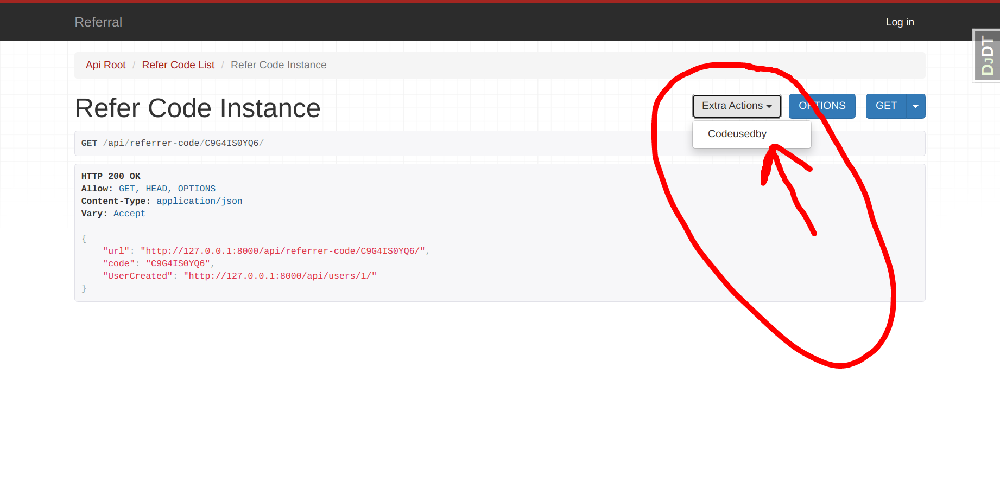
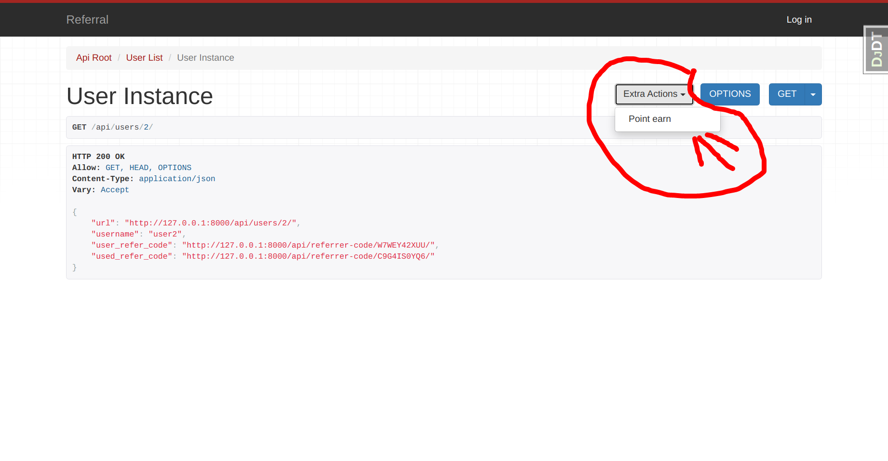

# [Referral Site]

> Features

- ## user can signup with referral-code and earn point, 'if code is correct'
- ## more api available at `http://127.0.0.1:8000/api/`
- ## user can see, how many users has used his code to signup, and point earned ,at `http://127.0.0.1:8000/profile/`
- ## api to check all users signup with a referCode 
- ## an user earn through referring other user 
  

## Packages Used 

- Django 
- Django_rest_framework

## How to use it

```bash
$ # Get the code
$ git clone https://github.com/RavinderSinghPB/referral.git
$
$ # Virtualenv modules installation (Unix based systems)
$ virtualenv env
$ source env/bin/activate
$
$ # Virtualenv modules installation (Windows based systems)
$ # virtualenv env
$ # .\env\Scripts\activate
$
$ # Install modules - SQLite Storage
$ pip3 install -r requirements.txt
$
$ # Create tables
$ python manage.py makemigrations
$ python manage.py migrate
$
$ # Start the application (development mode)
$ python manage.py runserver # default port 8000
$
$ # Access the web app in browser: http://127.0.0.1:8000/
```


## Try out! 

- ### all users signup with a referCode `http://127.0.0.1:8000/api/referrer-code/<code>/codeUsedBy/` where `<code>` is referrer code
    
- ### an user earn through referring other user `http://127.0.0.1:8000/api/users/pk/point_earn/` where 'pk' is primery-key of user
    